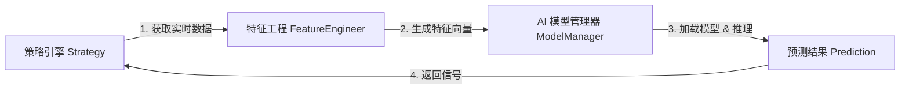
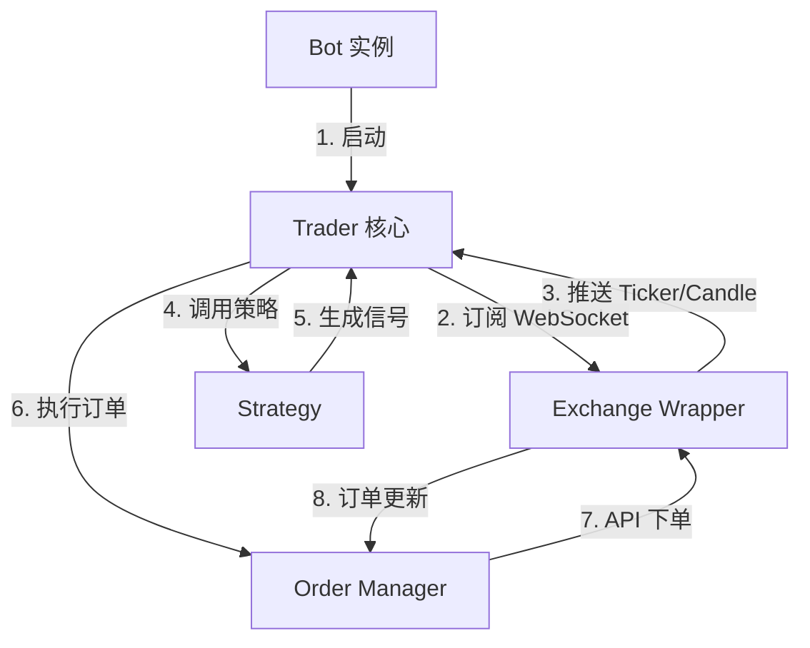

# AI 模型推理集成与实盘交易引擎对接设计

## 1. 目标

本文档旨在规划 **KoiQuant** 下一阶段的核心技术实现路径，主要解决两个关键问题：
1.  **AI 模型推理 (Inference)**: 如何在策略运行时加载已训练好的模型，并实时进行预测。
2.  **实盘引擎对接 (Live Execution)**: 如何将策略生成的信号 (Signal) 转化为真实的交易所订单 (Order)。

## 2. AI 模型推理集成设计

### 2.1 架构流程



### 2.2 核心组件设计

#### 2.2.1 `ModelManager` (模型管理器)

*   **职责**: 负责从磁盘/数据库加载模型文件 (`.pth`, `.joblib`)，并提供统一的 `predict(features)` 接口。
*   **缓存机制**: 避免每次 tick 都重新加载模型，需在策略初始化时加载并常驻内存。
*   **版本控制**: 支持通过 `model_id` 加载特定版本的模型。

#### 2.2.2 `FeatureEngineer` (特征工程复用)

*   **痛点**: 训练时的特征处理逻辑（如归一化、窗口滑动）必须与推理时完全一致，否则会导致 **训练-推理偏差 (Train-Serving Skew)**。
*   **方案**:
    *   将 `FeatureEngineer` 提取为独立模块。
    *   保存训练时的 `Scaler` (如 `MinMaxScaler`) 到文件，推理时加载该 Scaler 对实时数据进行同样的缩放处理。

### 2.3 接口定义 (Python)

```python
class AIStrategy(BaseStrategy):
    def __init__(self, config):
        self.model_manager = ModelManager(config['model_id'])
        self.feature_engineer = FeatureEngineer.load(config['model_id'])
        
    def on_candle(self, candle):
        # 1. 维护一个滑动窗口的 buffer (例如最近 100 根 K 线)
        self.buffer.append(candle)
        
        # 2. 特征工程 (复用训练时的逻辑)
        features = self.feature_engineer.transform(self.buffer)
        
        # 3. 推理
        prediction = self.model_manager.predict(features)
        
        # 4. 决策
        if prediction > 0.8:
            return "BUY"
        elif prediction < 0.2:
            return "SELL"
```

## 3. 实盘交易引擎对接设计

### 3.1 架构流程



### 3.2 核心组件设计

#### 3.2.1 `ExchangeWrapper` (交易所适配器)

*   **职责**: 统一不同交易所 (Binance, Kraken) 的 API 差异。
*   **技术栈**: 基于 `ccxt.async_support` 实现。
*   **功能**:
    *   `watch_ticker()` / `watch_ohlcv()`: 实时数据流。
    *   `create_order()` / `cancel_order()`: 交易执行。
    *   `fetch_balance()`: 资产查询。

#### 3.2.2 `OrderManager` (订单管理器)

*   **职责**: 管理订单生命周期，处理部分成交、网络异常等复杂情况。
*   **状态机**:
    *   `PENDING` -> `SUBMITTED` -> `PARTIALLY_FILLED` -> `FILLED`
    *   处理 **Sticky Orders** (挂单未成交时的追单逻辑)。

#### 3.2.3 `BotRunner` (机器人运行器)

*   **职责**: 作为一个独立的后台进程或协程运行，绑定 `Strategy` 和 `Exchange`。
*   **模式**:
    *   **Paper Mode**: 模拟撮合，不发送真实请求，只更新本地虚拟余额。
    *   **Live Mode**: 发送真实请求，更新交易所账户。

### 3.3 数据流与事件驱动

实盘引擎应采用 **事件驱动 (Event-Driven)** 架构：

1.  **Event: MARKET_DATA**: 收到新 K 线 -> 触发策略计算。
2.  **Event: SIGNAL**: 策略产生信号 -> 触发订单创建。
3.  **Event: ORDER_UPDATE**: 交易所推送成交信息 -> 更新持仓状态。

## 4. 实施计划

### 阶段一：AI 推理打通

1.  **重构 FeatureEngineer**: 确保训练和推理可复用代码。
2.  **实现 ModelManager**: 支持加载 LSTM 模型和 Scaler。
3.  **升级 AIStrategy**: 在 `backtest/engine.py` 中支持调用真实模型进行预测。

### 阶段二：实盘引擎基础

1.  **封装 ExchangeWrapper**: 实现基于 `ccxt` 的统一接口。
2.  **开发 PaperTrader**: 实现模拟撮合逻辑，支持在实盘界面跑模拟盘。

### 阶段三：实盘引擎进阶

1.  **开发 LiveTrader**: 对接真实 API Key，实现下单逻辑。
2.  **状态持久化**: 机器人重启后能恢复持仓和订单状态。
