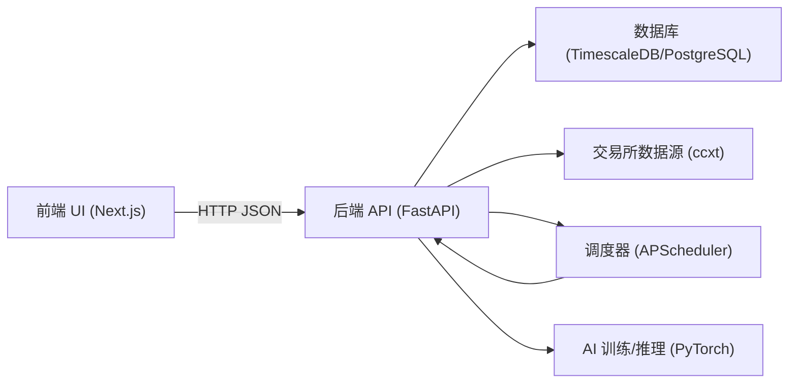

# 系统架构

## 逻辑组件图

## 数据流（简化）

1. 数据导入：ccxt → MarketService → Candle 表
2. 回测：Candle 表 → BacktestEngine → metrics + trades
3. AI 训练：Candle 表 → FeatureEngineer → LSTMModel → 模型工件 + 模型元数据
4. 策略执行（定时）：Scheduler → 拉取行情 → Strategy → OrderManager（目前以模拟为主）

## 关键工程点

- 异步 DB：Async SQLAlchemy + asyncpg
- 数据库建议：TimescaleDB 对时间序列友好
- 可演进方向：将“同步接口长任务”迁移到后台 worker

