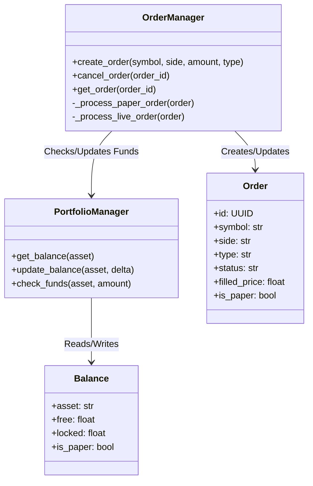

# 技术方案设计 - Phase 5: 实盘与模拟交易

## 架构概览

本模块主要由 `OrderManager` (订单管理) 和 `PortfolioManager` (资产管理) 组成。两者紧密协作，并共享数据库状态。



## 数据库设计

### 1. `orders` 表

用于存储所有交易订单。

| 字段名 | 类型 | 说明 |
| :--- | :--- | :--- |
| `id` | UUID | 主键 |
| `exchange` | String | 交易所标识 (如 'binance') |
| `symbol` | String | 交易对 (如 'BTC/USDT') |
| `side` | String | 'buy' 或 'sell' |
| `type` | String | 'market' 或 'limit' |
| `status` | String | 'pending', 'filled', 'cancelled', 'failed' |
| `price` | Float | 委托价格 (限价单) |
| `amount` | Float | 委托数量 |
| `filled_price` | Float | 成交均价 |
| `filled_amount` | Float | 成交数量 |
| `fee` | Float | 手续费 |
| `cost` | Float | 总成本 (filled_price * filled_amount + fee) |
| `is_paper` | Boolean | 是否为模拟盘 |
| `created_at` | DateTime | 创建时间 |
| `updated_at` | DateTime | 更新时间 |

### 2. `balances` 表

用于存储账户余额。对于模拟盘，我们需要初始化一组默认资金。

| 字段名 | 类型 | 说明 |
| :--- | :--- | :--- |
| `id` | Integer | 主键 |
| `exchange` | String | 交易所标识 |
| `asset` | String | 资产名称 (如 'BTC', 'USDT') |
| `free` | Float | 可用余额 |
| `locked` | Float | 冻结余额 (挂单中) |
| `is_paper` | Boolean | 是否为模拟盘 |
| `updated_at` | DateTime | 最后更新时间 |

## 核心逻辑

### 1. 模拟撮合 (Paper Trading Simulation)

为简化实现，初期仅支持 **市价单 (Market Order)** 的模拟。

1.  **下单**:
    -   检查资金是否充足 (`PortfolioManager.check_funds`)。
    -   创建订单，状态为 `FILLED` (市价单假设立即成交)。
    -   获取当前最新 K 线的 `close` 价格作为成交价。
    -   计算手续费 (例如 0.1%)。
    -   调用 `PortfolioManager` 更新余额。

2.  **资金结算**:
    -   **买入 BTC/USDT**: 减少 USDT (Cost)，增加 BTC (Amount * (1 - fee_rate))。
    -   **卖出 BTC/USDT**: 减少 BTC (Amount)，增加 USDT (Cost * (1 - fee_rate))。

### 2. 实盘接口 (预留)

-   `OrderManager` 将包含一个 `execute_strategy_signal` 方法，根据配置决定走模拟逻辑还是真实 API。

## API 接口 (Internal Services)

虽然主要通过内部 Python 调用，但也应设计清晰的 Service 方法：

```python
class OrderManager:
    async def place_order(self, session, order_params: CreateOrderSchema) -> Order
    async def get_orders(self, session, filter_params) -> List[Order]

class PortfolioManager:
    async def get_portfolio(self, session, exchange, is_paper=True) -> List[Balance]
    async def init_paper_account(self, session, assets: Dict[str, float])
```
