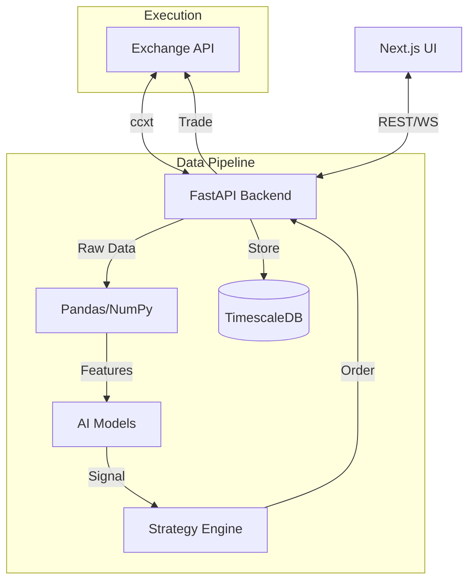

# 技术方案设计 - Gekko Reborn (AI Edition)

## 技术架构

### 技术栈选型

| 领域         | 选型                     | 理由                                                           |
| ------------ | ------------------------ | -------------------------------------------------------------- |
| **Web 前端** | Next.js (TypeScript)     | 行业标准的 React 框架，负责 UI 展示、配置管理和数据可视化。    |
| **核心后端** | Python 3.11+ (FastAPI)   | 高性能的异步 Python 框架，原生支持 OpenAPI，完美对接 AI 生态。 |
| **数据分析** | Pandas + NumPy           | 处理时间序列数据（K 线）的绝对标准，性能优异。                 |
| **AI/ML**    | PyTorch / Scikit-learn   | 深度学习与传统机器学习库，用于训练预测模型和策略优化。         |
| **数据库**   | PostgreSQL (TimescaleDB) | 带有 TimescaleDB 插件的 Postgres，专为金融时间序列数据优化。   |
| **任务队列** | Celery + Redis           | 异步处理耗时的模型训练和回测任务。                             |
| **部署**     | Docker Compose           | 容器化部署，确保 Python 环境和依赖的一致性。                   |

### 系统模块设计

系统采用 **前后端分离** 架构，通过 Docker Compose 编排。

#### 1. Frontend Service (Next.js)

- **Dashboard**: 实时展示账户权益、持仓分布、活跃策略状态。
- **Backtest UI**: 配置回测参数（时间段、模型超参），展示回测结果（收益率曲线、回撤图）。
- **Strategy Editor**: 可是化或代码编辑器，编写 Python 策略逻辑。
- **API Client**: 自动生成的 Axios 客户端，调用 FastAPI 接口。

#### 2. Backend Service (FastAPI)

- **Market Data Manager**:
  - 使用 `ccxt` 连接交易所 REST/WebSocket API。
  - 负责 K 线数据的清洗、标准化和入库 (TimescaleDB)。
- **Strategy Engine**:
  - **Vectorized Backtesting**: 基于 Pandas 的向量化回测引擎，速度极快。
  - **Event-driven Trading**: 实盘交易引擎，处理信号生成、订单路由和风控。
- **AI Model Manager**:
  - 管理机器学习模型的生命周期（训练、评估、推理、版本控制）。
  - 提供预测接口供策略调用（例如 `model.predict(last_100_candles)`）。
- **Scheduler**: 使用 `APScheduler` 执行定时任务（如每 15 分钟拉取 K 线）。

#### 3. Data Service (PostgreSQL + Redis)

- **TimescaleDB**: 存储海量 Tick 和 K 线数据，支持高效的时间窗口聚合查询。
- **Redis**:
  - 作为 Celery 的 Broker，分发异步任务。
  - 缓存热点数据（如最新价格）。

### 数据流图 (Data Flow)



### 目录结构规划

```
gekko-reborn/
├── frontend/             # Next.js 项目
│   ├── src/app/          # 页面路由
│   ├── src/components/   # UI 组件
│   └── ...
├── backend/              # FastAPI 项目
│   ├── app/
│   │   ├── api/          # 接口路由
│   │   ├── core/         # 配置与工具
│   │   ├── models/       # 数据库模型 (SQLAlchemy)
│   │   ├── schemas/      # Pydantic 数据验证
│   │   ├── services/     # 业务逻辑 (Market, Trade, AI)
│   │   └── strategies/   # 策略文件
│   ├── tests/
│   └── pyproject.toml
├── docker-compose.yml    # 容器编排
└── README.md
```
